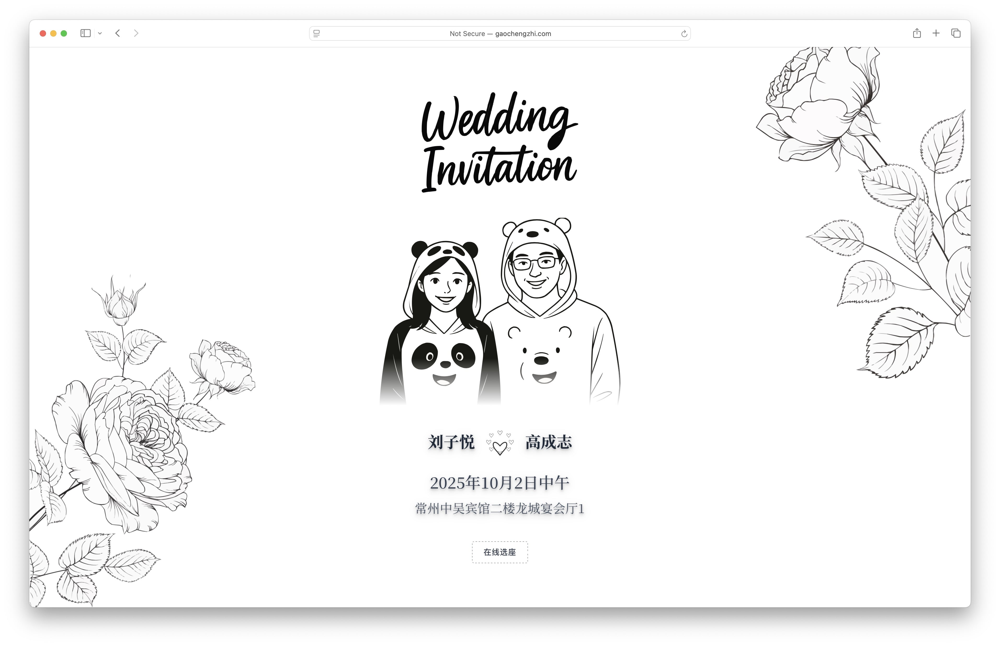
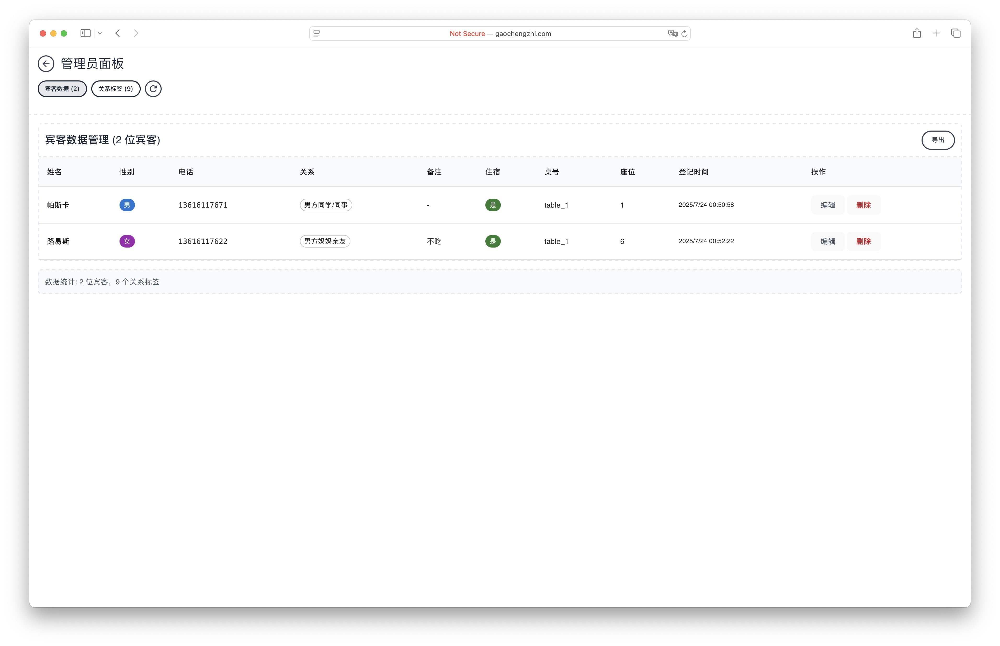
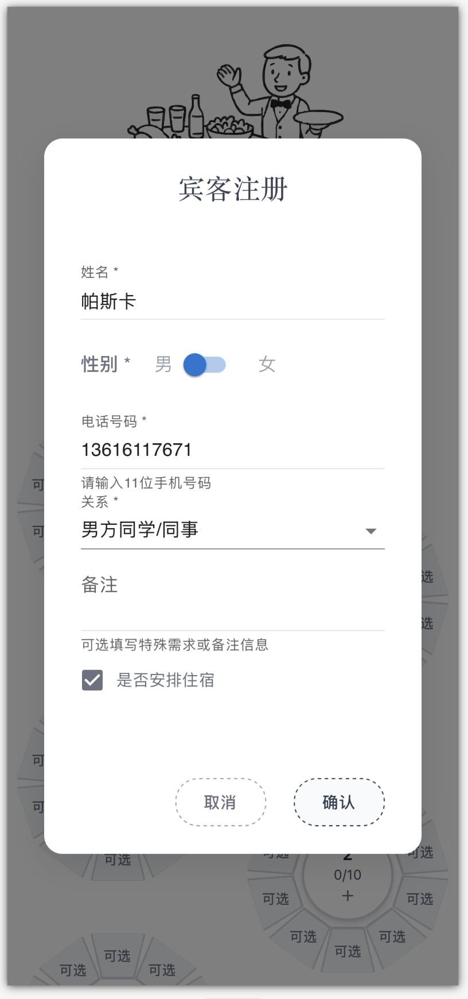
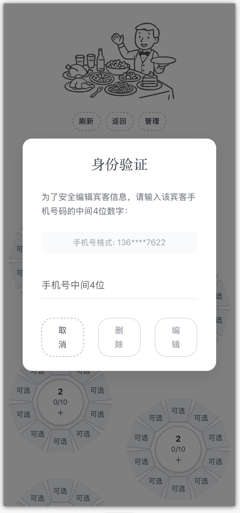
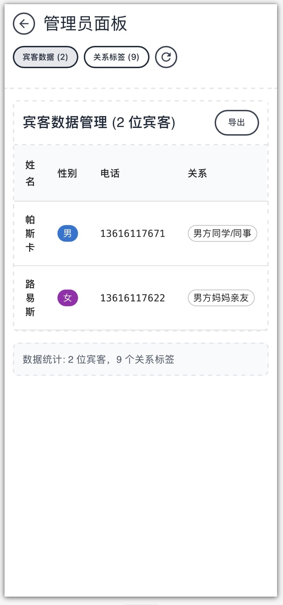
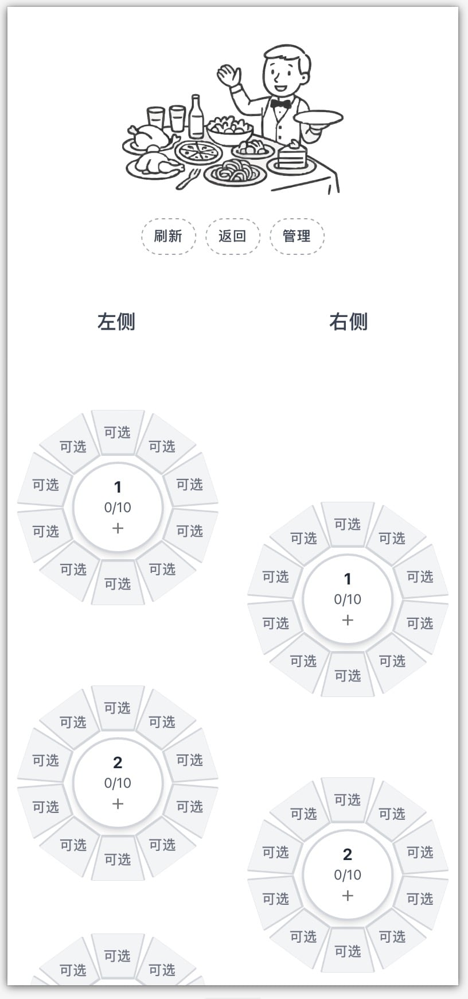
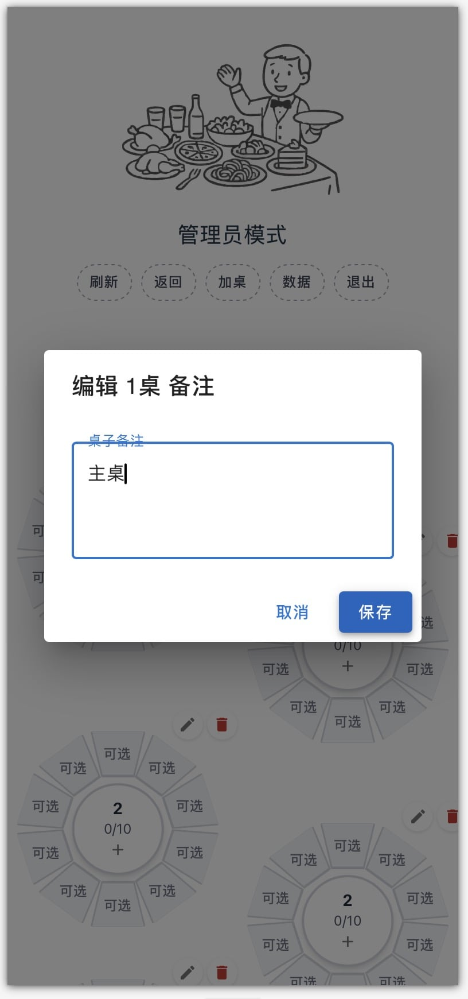

# Wedding Invitation & Seat Selection System

[](https://react.dev/)
[](https://vitejs.dev/)
[](https://mui.com/)
[](https://tailwindcss.com/)
[](https://expressjs.com/)
[](https://nodejs.org/)

An elegant wedding invitation system with online seat selection, statistics, rearrangement, and data export functionality.
Live Demo: http://gaochengzhi.com/wedding/

## 🌟 Features

- **Elegant Wedding Invitation**: Beautiful animated invitation page with couple photos and wedding details
- **Online Seat Selection**: Interactive round table layout with real-time seat management
- **Admin Management**: Complete guest management system with drag-and-drop functionality
- **Identity Verification**: Dual guest identity verification system with invitation code and phone number
- **Responsive Design**: Mobile-first design with desktop compatibility
- **Real-time Data**: Simple CSV-based data persistence with automatic synchronization

## 🚀 Technology Architecture

- **Frontend**: React 19 + Vite
- **UI Components**: Material-UI (MUI) + Tailwind CSS
- **Backend**: Express.js + Node.js
- **Data Storage**: CSV files
- **Environment**: .env configuration

## 📷 Screenshots

### Web Version

| Welcome Page                               | Management Page                              |
| :----------------------------------------- | :------------------------------------------- |
|  |  |

### Mobile Version

| Welcome Page                                 | Guest Registration                           | Identity Verification                         | Management Page                             | Seat Selection                             | Table Notes                              |
| :------------------------------------------- | :------------------------------------------- | :-------------------------------------------- | :------------------------------------------ | :----------------------------------------- | :--------------------------------------- |
|  |  |  |  |  |  |

## 🛠️ Installation & Setup

### Personal Configuration

Edit `.env.production` file configuration:
```env
NODE_ENV=production
APP_MODE=production
PRODUCTION_SERVER=74.48.115.131

# Invitation Code Configuration
ENABLE_INVITATION_CODE=false
INVITATION_CODE=5201314

# Super Admin Credentials
ADMIN_USERNAME=root
ADMIN_PASSWORD=root

# Wedding Details
GROOM_NAME=高成志
BRIDE_NAME=刘子悦
WEDDING_DATE=2025年10月2日中午
WEDDING_LOCATION=常州中吴宾馆二楼龙城宴会厅1

# Table and Seat Configuration
DEFAULT_SEATS_PER_TABLE=10
TABLES_PER_SIDE=11
TOTAL_TABLES=22
MAX_SEATS_PER_TABLE=16

# Phone Validation Configuration
PHONE_NUMBER_LENGTH=11

# Image assets are now imported directly in components
# No need for environment variable paths

# Server Configuration (Backend)
PORT=3001

# API Base URL Configuration (Frontend)
API_BASE_URL=http://74.48.115.131:3001/api
PRODUCTION_API_BASE_URL=http://74.48.115.131:3001/api
```

Configure subdomain

```js
import { defineConfig } from 'vite'
import react from '@vitejs/plugin-react'
import tailwindcss from '@tailwindcss/vite'

export default defineConfig(({ mode }) => ({
    base: mode === 'production' ? '/wedding/' : '/',
    plugins: [
        react(),
        tailwindcss(),
    ],
}))
```

### 4. Development Mode
Run both frontend and backend simultaneously:
```bash
npm run dev:full
```

Or run separately:
```bash
# Terminal 1 - Backend server
npm run server

# Terminal 2 - Frontend development
npm run dev
```

Application access addresses:
- Frontend: `http://localhost:5173`
- Backend API: `http://localhost:3001`

## 🏗️ Production Deployment

### 1. Build frontend
```bash
npm run build
```

### 2. Production server structure
```
production-server/
├── dist/                   # Frontend build files
├── server/                 # Backend files
│   ├── server.js
│   ├── config.js
│   └── data/               # CSV data files
├── .env                    # Production environment configuration
├── package.json
└── node_modules/
```

### 3. Production deployment steps

#### Step 1: Prepare deployment files
```bash
# Files to upload to production server:
- dist/ (frontend build output)
- server/ (backend code)
- .env (production environment configuration)
- package.json
```

#### Step 2: Server setup
```bash
# Execute on production server
npm install --production

# Start backend service
cd server
node server.js
```

#### Step 3: Web server configuration (Nginx)
```nginx
server {
    listen 80;
    server_name gaochengzhi.com www.gaochengzhi.com;

    # ------------ ACME challenge (for renewal) ------------
    location /.well-known/acme-challenge/ {
        root /var/www/html;
    }

    # ------------ Wedding static site ------------
    location ^~ /wedding/ {
        alias /home/kounarushi/wedding/;   # Your dist directory
        index index.html;
        try_files $uri $uri/ /wedding/index.html;  # For frontend routing
    }

    # ------------ Other requests to backend ------------
    location / {
        proxy_pass http://127.0.0.1:8888;  # Your Next.js / Node service
        proxy_http_version 1.1;
        proxy_set_header Upgrade $http_upgrade;
        proxy_set_header Connection "upgrade";
        proxy_set_header Host $host;
        proxy_set_header X-Real-IP        $remote_addr;
        proxy_set_header X-Forwarded-For  $proxy_add_x_forwarded_for;
        proxy_set_header X-Forwarded-Proto $scheme;
    }
}

server {
    listen 443 ssl http2;                       # Listen on 443
    server_name gaochengzhi.com www.gaochengzhi.com;

    # ---- Certificate paths (replace with your actual paths) ----
    ssl_certificate     /etc/letsencrypt/live/gaochengzhi.com/fullchain.pem;
    ssl_certificate_key /etc/letsencrypt/live/gaochengzhi.com/privkey.pem;

    # ---- Redirect to HTTP in one line ----
    return 301 http://$host$request_uri;
}
```

## 🎯 Usage Guide

### Admin Features
1. **Admin Login**: Username: `root`, Password: `root`
2. **Drag & Drop**: Move guests between seats via drag and drop
3. **Table Management**: Add/delete tables and add table notes
4. **Guest Management**: View all guest data in table format
5. **Relationship Management**: Manage guest relationship categories

## 🔧 API Endpoints

### Guest Management
- `GET /api/guests` - Get all guests
- `POST /api/guests` - Save/update guest information
- `DELETE /api/guests/:seatId/:tableId` - Delete specific guest
- `DELETE /api/guests` - Clear all data

### Table Management  
- `GET /api/tables` - Get all tables
- `POST /api/tables` - Create new table
- `DELETE /api/tables/:tableId` - Delete table
- `POST /api/tables/:tableId/notes` - Update table notes

### System
- `GET /api/health` - Health check
- `GET /api/relationships` - Get relationship categories

## 🔒 Security Features

- Dual identity verification with invitation code and phone number
- Admin authentication system
- Data validation and sanitization
- Automatic data backup system
- Environment-based configuration

## 🐛 Development Notes

### Environment Detection
- **Test Mode** (localhost): Auto-fills invitation code, direct access
- **Production Mode**: Requires correct invitation code input

### Data Management
- All data stored in CSV files in `server/data/`
- Automatic backup system for data protection
- Real-time synchronization between frontend and backend
---

For deployment support or technical issues, please check the troubleshooting section in the documentation.