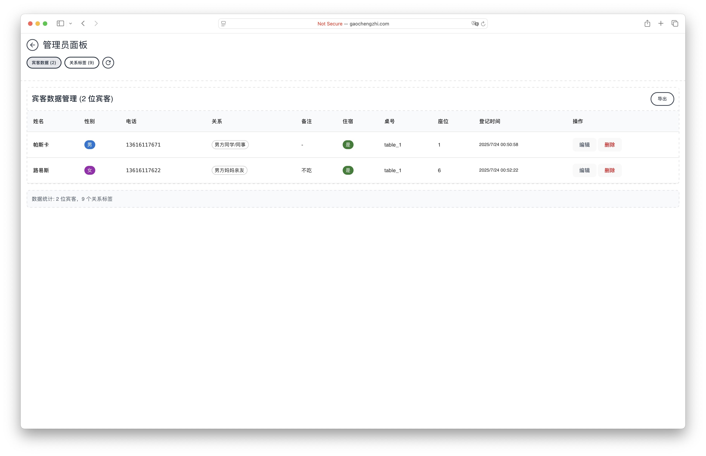
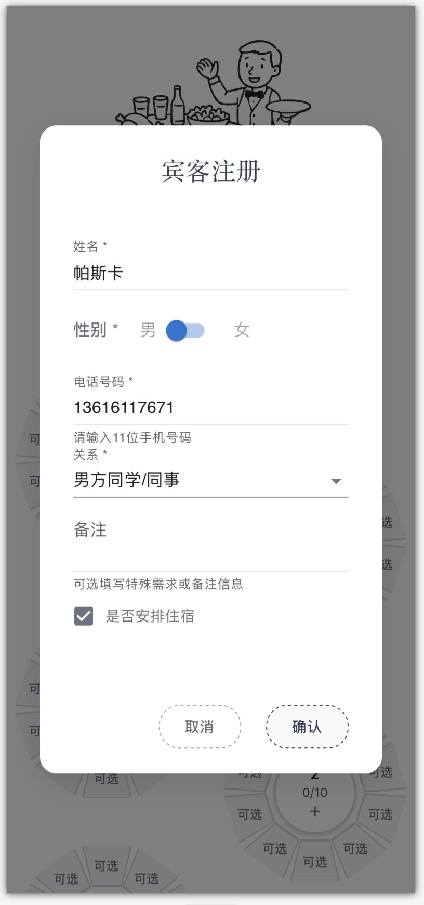
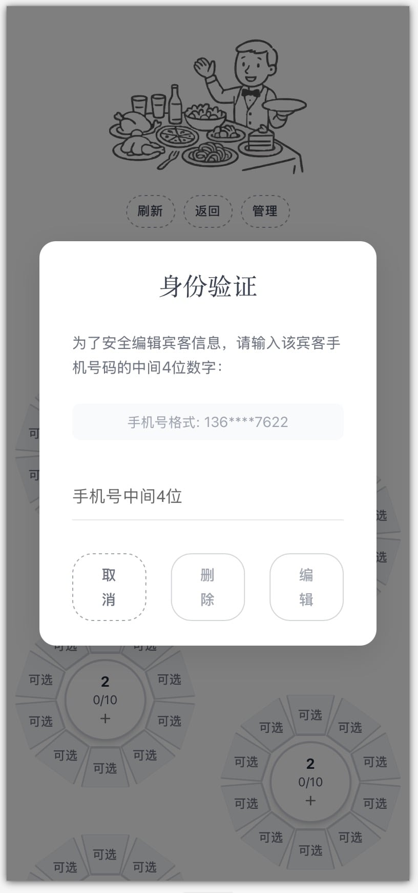
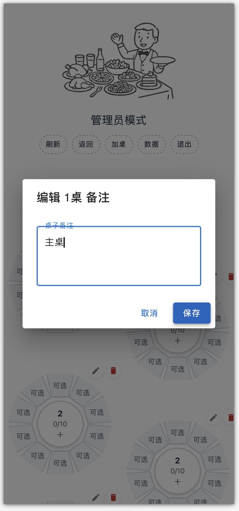

# 婚礼邀请函与在线选座系统


[](https://react.dev/)
[](https://vitejs.dev/)
[](https://mui.com/)
[](https://tailwindcss.com/)
[](https://expressjs.com/)
[](https://nodejs.org/)


一个优雅的婚礼邀请系统，支持在线选座、统计、重排、数据导出功能。
在线体验：http://gaochengzhi.com/wedding/
## 功能特性

- **优雅的婚礼邀请函**: 精美动画邀请页面，包含新人照片和婚礼详情
- **在线座位选择**: 交互式圆桌布局，实时座位管理
- **管理员功能**: 完整的宾客管理系统，支持拖拽操作
- **身份验证**: 邀请码+电话的双重宾客身份验证系统
- **响应式设计**: 移动端优先、兼容桌面端的界面设计
- **实时数据**: 基于简单CSV的数据持久化，自动同步
## 屏幕截图

### 网页端

| 欢迎页面                                   | 管理页面                                     |
| :----------------------------------------- | :------------------------------------------- |
|  |  |

### 移动端

| 欢迎页面                                     | 宾客注册                                     | 身份验证                                      | 管理页面                                    | 座位选择                                   | 桌子备注                                 |
| :------------------------------------------- | :------------------------------------------- | :-------------------------------------------- | :------------------------------------------ | :----------------------------------------- | :--------------------------------------- |
|  |  |  |  |  |  |


## 技术架构

- **前端**: React 19 + Vite
- **UI组件**: Material-UI (MUI) + Tailwind CSS
- **后端**: Express.js + Node.js
- **数据存储**: CSV文件
- **环境配置**: .env配置文件


## ️ 安装与配置

### 个性设置

编辑 `.env.production` 文件配置：
```env
NODE_ENV=production
APP_MODE=production
PRODUCTION_SERVER=74.48.115.131

# Invitation Code Configuration
ENABLE_INVITATION_CODE=false
INVITATION_CODE=5201314

# Super Admin Credentials
ADMIN_USERNAME=root
ADMIN_PASSWORD=root

# Wedding Details
GROOM_NAME=高成志
BRIDE_NAME=刘子悦
WEDDING_DATE=2025年10月2日中午
WEDDING_LOCATION=常州中吴宾馆二楼龙城宴会厅1

# Table and Seat Configuration
DEFAULT_SEATS_PER_TABLE=10
TABLES_PER_SIDE=11
TOTAL_TABLES=22
MAX_SEATS_PER_TABLE=16

# Phone Validation Configuration
PHONE_NUMBER_LENGTH=11

# Image assets are now imported directly in components
# No need for environment variable paths

# Server Configuration (Backend)
PORT=3001

# API Base URL Configuration (Frontend)
API_BASE_URL=http://74.48.115.131:3001/api
PRODUCTION_API_BASE_URL=http://74.48.115.131:3001/api
```

配置子域名

```js
import { defineConfig } from 'vite'
import react from '@vitejs/plugin-react'
import tailwindcss from '@tailwindcss/vite'

export default defineConfig(({ mode }) => ({
    base: mode === 'production' ? '/wedding/' : '/',
    plugins: [
        react(),
        tailwindcss(),
    ],
}))
```

### 4. 开发模式
同时运行前后端：
```bash
npm run dev:full
```

或分别运行：
```bash
# 终端1 - 后端服务器
npm run server

# 终端2 - 前端开发
npm run dev
```

应用程序访问地址：
- 前端: `http://localhost:5173`
- 后端API: `http://localhost:3001`

## ️ 生产部署

### 1. 构建前端
```bash
npm run build
```

### 2. 生产服务器结构
```
production-server/
├── dist/                   # 前端构建文件
├── server/                 # 后端文件
│   ├── server.js
│   ├── config.js
│   └── data/               # CSV数据文件
├── .env                    # 生产环境配置
├── package.json
└── node_modules/
```

### 3. 生产部署步骤

#### 步骤1: 准备部署文件
```bash
# 需要上传到生产服务器的文件：
- dist/ (前端构建输出)
- server/ (后端代码)
- .env (生产环境配置)
- package.json
```

#### 步骤2: 服务器设置
```bash
# 在生产服务器上执行
npm install --production

# 启动后端服务
cd server
node server.js
```

#### 步骤3: Web服务器配置 (Nginx)
```nginx
server {
    listen 80;
    server_name gaochengzhi.com www.gaochengzhi.com;


    # ------------ ACME 挑战（续期用）------------
    location /.well-known/acme-challenge/ {
        root /var/www/html;
    }

    # ------------ 婚礼静态站 ------------
    location ^~ /wedding/ {
        alias /home/kounarushi/wedding/;   # 你的 dist 所在目录
        index index.html;
        try_files $uri $uri/ /wedding/index.html;  # 用于前端路由
    }

    # ------------ 其它请求交给后端 ------------
    location / {
        proxy_pass http://127.0.0.1:8888;  # 你的 Next.js / Node 服务
        proxy_http_version 1.1;
        proxy_set_header Upgrade $http_upgrade;
        proxy_set_header Connection "upgrade";
        proxy_set_header Host $host;
        proxy_set_header X-Real-IP        $remote_addr;
        proxy_set_header X-Forwarded-For  $proxy_add_x_forwarded_for;
        proxy_set_header X-Forwarded-Proto $scheme;
    }
}


server {
    listen 443 ssl http2;                       # 监听 443
    server_name gaochengzhi.com www.gaochengzhi.com;

    # ---- 证书路径（换成自己实际的）----
    ssl_certificate     /etc/letsencrypt/live/gaochengzhi.com/fullchain.pem;
    ssl_certificate_key /etc/letsencrypt/live/gaochengzhi.com/privkey.pem;

    # ---- 一行完成跳转 ----
    return 301 http://$host$request_uri;
}
```


